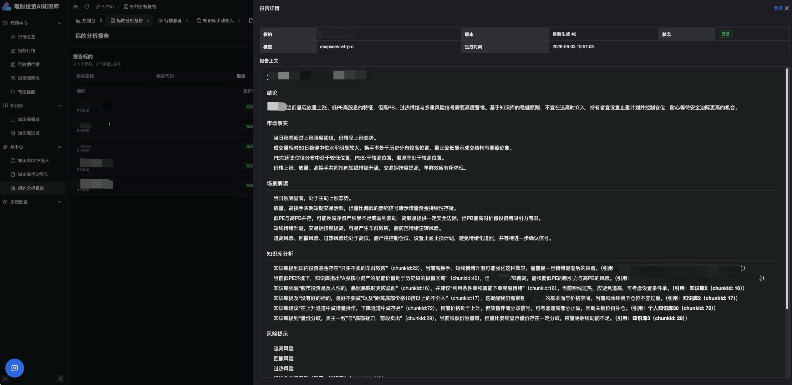

# 理财分析 AI 项目

## 项目介绍

本项目是一个面向个人投资研究的理财分析 AI 系统，目标是接入股市相关 API，采集、存储、分析市场数据，并结合自建知识库输出结构化的投资分析建议。

系统会将股市行情、财务指标、新闻或公告等数据进行清洗和结构化处理，存入 PostgreSQL 数据库；同时对知识库内容和部分文本类数据进行向量化，支持语义检索和相似内容匹配。知识库来源主要是手写副本的扫描件，需要经过 OCR 识别、文本清洗、切分、向量化后进入检索流程。

项目采用 Java、Python、Vue 混合架构：

- Java Spring Boot 负责核心业务系统、权限、任务调度、数据编排、接口聚合和后端管理能力。
- Python RabbitMQ Worker 负责模型微调、Embedding、向量检索、AI 推理等复杂 AI 计算能力，通过消息队列进行异步处理。
- Vue 负责前端展示，包括股市行情看板、分析结果展示、知识库管理和任务状态查看。
- PostgreSQL 负责业务数据、行情数据、结构化分析结果和向量化数据存储。
- Docker 负责项目整体部署和本地开发环境编排。

## 文档索引

项目文档统一放在 `docs/` 目录：

| 文档 | 说明                                                                              |
| --- |---------------------------------------------------------------------------------|
| [docs/REPORT_PIPELINE.md](./docs/REPORT_PIPELINE.md) | AI 分析报告全链路实现说明。                                                                 |
| [docs/img/架构图.png](./docs/img/架构图.png) | 系统架构图。                                                                          |
| [docs/img/report流程图.png](./docs/img/report流程图.png) | 分析报告流程图。                                                                        |
| [docs/img/报告示例图.jpg](./docs/img/报告示例图.jpg) | 报告页面效果示例图。                                                                      |
| [docs/OCR_PIPELINE.md](./docs/OCR_PIPELINE.md) | OCR 全链路实现说明，包括 Java/Python 边界、RabbitMQ 队列、阶段消息、MinIO 产物、人工复核、chunk 打标、软删除和向量入库。 |
| [docs/API_DOCUMENTATION.md](./docs/API_DOCUMENTATION.md) | 后端接口文档，记录主要 API 的请求方式、请求参数和响应结构。                                                |
| [docs/COMPLETED_REQUIREMENTS.md](./docs/COMPLETED_REQUIREMENTS.md) | 已完成需求记录，用于追踪阶段性功能交付情况。                                                          |
| [docs/CODEX_GUIDELINES.md](./docs/CODEX_GUIDELINES.md) | 写代码、改代码和审查代码时需要遵守的协作与代码规范。                                                      |
| [docs/chunk入库打标签文档.md](./docs/chunk入库打标签文档.md) | Chunk 场景标签规则和 LLM 打标方案。                                                         |
| [docs/标的标签计算规则.md](docs/标的标签计算规则.md) | 标的标签计算规则。                                                                       |
| [docs/FUTURE_WORK.md](./docs/FUTURE_WORK.md) | 后续能力建设和需求。                                                                      |

模块内文档：

| 文档 | 说明 |
| --- | --- |
| [backend-java/README.md](./backend-java/README.md) | Java 后端聚合工程说明。 |
| [backend-java/finance-ai/README.md](./backend-java/finance-ai/README.md) | Java AI 能力模块说明，包括 AI Chat、OCR 上传、人工复核和知识库接口。 |
| [backend-java/finance-service/README.md](./backend-java/finance-service/README.md) | Java 主服务说明。 |
| [database/README.md](./database/README.md) | 数据库和迁移脚本说明。 |
| [frontend-vue/README.md](./frontend-vue/README.md) | 前端工程说明。 |

## 核心目标

- 接入股市 API，定时获取股票行情、指数、财务数据、公告或新闻等信息。
- 将原始市场数据清洗后存入 PostgreSQL，形成可查询、可追踪的数据资产。
- 对知识库扫描件进行 OCR、文本清洗、分段和向量化处理。
- 基于股市数据和知识库内容进行语义检索与对比分析。
- 输出结构化分析报告，例如风险提示、趋势判断、关注指标、参考依据和知识库引用等。
- 提供前端可视化页面，展示股市数据、AI 分析过程和结果。

## 技术栈

### 后端服务

- Java 17+
- Spring Boot 3.x + Spring Security + Spring Scheduling + Spring AI
- MyBatis-Plus 3.5 + PostgreSQL + pgvector
- InfluxDB（分时走势）
- RabbitMQ（OCR 消息队列）
- MinIO（OCR 文件存储）
- Lombok + Hutool + Jackson

### AI 服务

- Python 3.11+
- RabbitMQ worker（消息队列消费者，全异步处理）
- Sentence Transformers / Embedding 模型
- OCR 大模型接口（阿里云 DashScope `qwen-vl-ocr-latest`）
- LLM 接口（DeepSeek V4 Pro，场景标签生成）

### 前端

- Vue 3 + TypeScript + Vite
- Vben Admin v5 (Element Plus)
- Pinia + Vue Router
- ECharts / TradingView Lightweight Charts

### 数据库与存储

- PostgreSQL（业务数据、行情快照、日K线）
- pgvector（向量检索）
- InfluxDB（分时走势）
- MinIO（OCR 文件存储）
- RabbitMQ（OCR 阶段消息）

### 部署方式

- Docker + Docker Compose

## 前端启动

前端骨架已接入 Vben Admin，当前默认使用 Element Plus 版本：

```bash
./scripts/run-frontend.sh
```

也可以直接进入前端目录启动：

```bash
cd frontend-vue
pnpm install
pnpm dev:ele
```

## 推荐目录结构

```text
financial-management-ai/
├── README.md                         # 项目说明文档
├── .gitignore                        # Git 忽略规则
├── pom.xml                           # Maven 聚合工程配置
├── docs/                             # 项目文档
│   ├── OCR_PIPELINE.md               # OCR 全链路说明
│   ├── REPORT_PIPELINE.md            # AI 分析报告流程
│   ├── API_DOCUMENTATION.md          # 接口文档
│   ├── CODEX_GUIDELINES.md           # 代码规范
│   ├── COMPLETED_REQUIREMENTS.md     # 已完成需求记录
│   ├── chunk入库打标签文档.md         # 场景标签方案
│   └── img/                          # 文档图片素材
├── backend-java/                     # Java 后端聚合目录
│   ├── pom.xml                       # Java 后端聚合工程配置
│   ├── finance-service/              # 主业务 Java 服务
│   │   ├── Dockerfile                # 主业务服务 Docker 构建文件
│   │   ├── pom.xml                   # 主业务服务 Maven 配置
│   │   └── src/
│   │       ├── main/
│   │       │   ├── java/
│   │       │   │   └── com/scrapider/finance/
│   │       │   │       ├── FinanceApplication.java # Spring Boot 启动类
│   │       │   │       ├── controller/             # 控制层
│   │       │   │       ├── service/                # 服务层接口
│   │       │   │       ├── manage/                 # MyBatis-Plus 管理封装
│   │       │   │       ├── mapper/                 # MyBatis-Plus Mapper
│   │       │   │       └── domain/                 # 领域对象
│   │       │   └── resources/
│   │       │       └── application.yml             # 应用配置
│   │       └── test/                 # Java 测试代码
│   └── finance-ai/                   # Spring AI Java 能力模块
│       ├── pom.xml                   # AI 模块 Maven 配置
│       └── src/
├── ai-python/                        # Python AI 服务
│   ├── app/
│   │   ├── core/                     # 配置、日志
│   │   ├── ocr/                      # OCR 处理（engines/handlers/services）
│   │   ├── messaging/                # RabbitMQ 消息通信
│   │   └── worker/                   # Worker 启动入口
│   ├── tests/                        # Python 测试代码
│   ├── requirements.txt              # Python 依赖
│   └── README.md                     # AI 服务说明
├── frontend-vue/                     # Vue 前端项目
│   ├── src/
│   │   ├── api/                      # 前端接口请求
│   │   ├── assets/                   # 静态资源
│   │   ├── components/               # 通用组件
│   │   ├── router/                   # 路由配置
│   │   ├── stores/                   # Pinia 状态管理
│   │   └── views/                    # 页面
│   ├── package.json                  # 前端依赖配置
│   └── README.md                     # 前端说明
├── database/                         # 数据库相关文件
│   ├── migrations/                   # 数据库迁移脚本
│   ├── seed/                         # 初始化数据
│   └── pgvector/                     # 向量表和索引脚本
├── data/                             # 本地数据目录，不提交 Git
│   ├── raw/                          # 原始数据
│   ├── scans/                        # 知识库扫描件
│   ├── ocr/                          # OCR 识别结果
│   └── processed/                    # 清洗后的数据
├── scripts/                          # 工具脚本
│   ├── init-db.sh                    # 初始化数据库脚本
│   ├── run-java.sh                   # 启动 Java 服务
│   ├── run-python.sh                 # 启动 Python 服务
│   └── run-frontend.sh               # 启动前端服务
└── docker/                           # Docker 相关配置
    ├── docker-compose.yml            # 项目部署和本地开发环境编排
    ├── postgres/                     # PostgreSQL 配置
    └── nginx/                        # 前端或网关配置
```

## 系统模块规划

### 行情数据模块

- 对接股票、指数、可转债等外部行情 API。
- 支持定时拉取（批量）、手动同步和失败重试。
- 保存原始响应和清洗后的结构化数据。
- 提供历史行情查询和分时走势展示接口。

### 知识库模块

- 管理手写副本扫描件和识别后的文本。
- 对扫描件执行 OCR 识别，图片走视觉 OCR，PDF 走 OpenDataLoader 解析并适配为统一分段。
- 支持手动文本知识导入，直接进入场景打标和向量入库流程。
- 对识别文本进行清洗、分段和元数据标注。
- 支持人工复核修改、合并、删除段落。
- 支持知识库浏览、标签过滤、标签分布概览和单条内容编辑。
- 生成向量并写入 PostgreSQL pgvector 表。

### AI 分析模块

- 接收用户分析请求，Query Rewrite 拆解意图。
- 查询行情上下文（股票/指数行情、分时、日K）。
- 向量检索召回相关知识库片段。
- 通过 DeepSeek ChatClient 输出结构化回答。

### 投资报告模块

- 支持按股票、指数、可转债选择标的生成报告。
- 支持快速分析、风险检查、估值报告三类报告类型。
- Java 负责行情上下文、任务状态、动态 chunk 分配、知识库召回、报告保存和历史查询。
- Python worker 负责当前标的场景标签计算和检索 query embedding 生成，并通过回调继续 Java 流程。
- 报告生成后保存结构化 JSON、渲染文本、模型、版本号和引用依据，支持重新生成。

### 交易辅助模块

- 投资观察池：多分组、多类型标的（股票/指数/可转债）管理，实时行情刷新。
- 股票预警：按涨跌幅阈值设置预警，定时检查触发提醒。

### 前端展示模块

- 行情总览、指数行情、可转债行情页面。
- AI 中心：知识库处理队列、人工复核、报告生成。
- 知识库浏览、知识库概览、股票预警管理、控制台指标。
- AI Chat 对话页面。

## 初步数据流

```text
股市 API
  ↓
Java 定时任务 / 数据同步服务
  ↓
PostgreSQL 结构化存储
  ↓
Java 发布消息到 RabbitMQ
  ↓
Python Worker 消费消息执行 AI 计算（Embedding / OCR / LLM 推理）
  ↓
返回结构化分析结果
  ↓
Java 保存结果并提供接口
  ↓
Vue 前端展示
```

报告生成流程：

```text
用户选择标的和报告类型
  ↓
Java 创建 scene_analysis_task，组装行情上下文并发布 RabbitMQ 消息
  ↓
Python 计算 currentScenes 并回调 Java
  ↓
Java 计算 chunkAllocation，生成分类检索任务并发布 query embedding 消息
  ↓
Python 生成检索 queryEmbedding 并回调 Java
  ↓
Java 按场景做 pgvector 召回、标签过滤、类内重排和 knowledgeContext 构建
  ↓
Java 异步调用 DeepSeek 生成结构化报告
  ↓
保存 scene_analysis_report，前端轮询展示报告和历史版本
```

知识库处理流程：

```text
扫描件或 PDF 上传
  ↓
文档标准化
  ↓
OCR 识别（图片视觉 OCR / PDF OpenDataLoader）
  ↓
文本清洗
  ↓
人工复核
  ↓
规则打标
  ↓
LLM 打标
  ↓
标签回正
  ↓
Embedding 向量化
  ↓
写入 PostgreSQL pgvector
  ↓
用于 AI 检索增强分析
```

OCR 详细阶段、消息体、产物目录和人工复核规则见 [docs/OCR_PIPELINE.md](./docs/OCR_PIPELINE.md)。

## 报告效果示例



说明：当前报告效果仍受知识库数据完整度、人工审核工作量和 OCR 识别准确率影响。如果知识库覆盖不健全、人工复核不足，或 OCR 将原文识别错误，都会导致召回依据不完整、引用片段偏差和报告质量下降。报告内容仅用于个人研究辅助，不应作为确定性投资建议。

## 免责声明

本项目生成的行情分析、知识库召回和投资报告内容仅供个人学习、研究和复盘参考，不构成任何投资建议、收益承诺或交易指令。模型输出可能受到数据延迟、数据缺失、OCR 识别错误、知识库覆盖不足、提示词和参数配置等因素影响，使用者需要结合自身风险承受能力和其他可靠信息独立判断，并自行承担投资决策风险。

## 开发约定

- 项目文档、代码注释、提交说明优先使用中文。
- Java 服务负责业务稳定性、数据一致性和系统对外接口。
- Python 服务负责 AI 能力，不直接承担复杂业务编排。
- 前后端接口返回结构保持清晰、可追踪、可扩展。
- 所有模型输出都需要保留引用依据，避免只有结论没有来源。
- 原始数据、扫描件、模型文件、日志文件不提交到 Git。

## License

本项目基于 [MIT License](./LICENSE) 开源。
