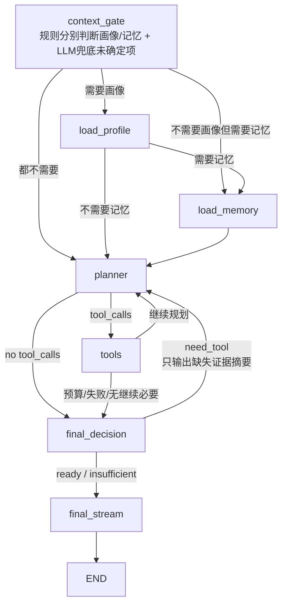

# AI Chat Agent LangGraph 重构设计

## 背景

AI Chat 当前使用手写循环：

```text
planner -> tools -> planner -> final_answer
```

加入用户画像后，最终回答阶段会拿到更严格的买卖建议约束，例如“买入建议必须有工具结果或知识库依据”。当模型在最终回答阶段判断现有证据不足时，它真正想做的是继续调用工具，但当前阶段只有文本输出通道，没有回到工具阶段的结构化路径，于是工具意图和最终回答职责混在了一起。

这个问题的根因不是前端渲染，也不是用户画像表，而是 agent 编排模型不支持“最终判断发现证据不足后回到工具阶段”。

## 目标

1. 用 LangGraph 重写 AI Chat agent 编排。
2. 不保留旧的手写 `AgentLoopRunner` 功能，也不做运行时开关双轨。
3. 支持最终判断阶段发现信息不足后回到工具规划和工具执行。
4. 保证只有真正的最终自然语言回答可以流式输出到前端。
5. 保持现有对话保存、`answer_delta`、`final_answer`、Token 统计和 Java data gateway 鉴权语义。
6. 用户画像继续只作为当前用户画像读取，不保存到 message metadata。
7. Java 侧除 Token 用量 `phase` 枚举和前端展示选项外，不改变任何接口、请求参数、响应结构或鉴权方式。
8. 除了适配 LangGraph 和拆分 final answer 所必需的内部状态结构外，不改变现有 agent 业务行为。

## 非目标

1. 不做前端 UI 改造。
2. 不改问卷和画像评分规则。
3. 不改 Java data gateway 的请求签名和权限模型。
4. 不实现自动交易或真实下单。
5. 不保留旧 loop 作为 fallback。
6. 不改 Java 侧 agent、tool、画像、行情和知识库相关接口；这些接口只作为既有能力被 Python graph 调用。
7. 不重新设计工具选择策略、画像评分规则、买卖建议策略和模型配置。

## 迁移边界

这次重构的本质是 Python 编排迁移：

```text
旧：planner -> tools -> planner -> final_answer
新：context_gate -> load_profile? -> load_memory? -> planner -> tools -> planner/final_decision -> final_stream
```

其中核心变化有三点：

1. 用 LangGraph 表达原来的 planner/tools 循环，替代手写 loop。
2. 在 planner 前增加 `context_gate/load_profile/load_memory`，由同一个轻量门控分别判断是否需要画像和短期记忆；某一类规则未判断出来时，用轻量 LLM 兜底分类。
3. 把原来的 final answer 拆成 `final_decision` 和 `final_stream`，让最终判断阶段如果发现证据不足，可以通过图的边回到 planner/tools。

除此之外必须保持现有语义：

- Java data gateway action、请求/响应结构不变；Python LangChain tool schema 可以收紧到 Java 既有契约，例如 `scene_signal_context` 必须同时传入 `target_code` 和 `target_name`。
- 现有 prompt 的业务约束尽量迁移复用，只按节点拆分做必要调整。
- `ToolCallBudget` 仍是唯一预算来源；默认预算按实际链路需要扩大到原来的 2 倍，工具失败语义不新增同义配置。
- 现有对话保存、WebSocket 事件、`answer_delta`、`final_answer` payload 语义不变。
- 现有用户画像读取和买卖建议策略不借本次 LangGraph 重构重新设计；需要放进 state 的字段只是为了让 graph 节点传递既有决策结果。
- 同一轮工具结果复用只用于 graph 内部状态管理，避免 final 回退后重复真实调用 Java；它不是跨会话缓存，也不改变工具返回内容。

## 方案比较

### 方案一：只加强 final prompt

做法：

- 在最终回答 prompt 中禁止工具调用。

问题：

- 只能增加文本约束，不能解决“证据不足时需要补查工具”的真实需求。
- 模型会被迫在证据不足时降级回答，体验不稳定。

结论：不满足当前目标。

### 方案二：在旧手写 loop 中增加 backtrack

做法：

- 保留现有 `AgentLoopRunner`。
- 在 `answer_from_scratchpad` 前增加判断节点。
- 如果判断需要工具，就回到 planner。

问题：

- 手写循环会继续膨胀，状态、预算、流式、Token 归因都会变得更难维护。
- 用户明确要求代码干净，不保留旧功能。

结论：不采用。

### 方案三：用 LangGraph 重写为状态机

做法：

- 用图节点显式表达 planner、tool、final decision、final stream。
- final decision 可以回到 planner。
- final stream 是唯一流式输出节点。
- 删除旧手写 loop。

优点：

- 阶段边界清楚。
- 回路是图结构的一等能力。
- 更容易做预算控制、Token 归因和最终输出隔离。

结论：采用。

## 总体架构



核心原则：

- `planner` 和 `tools` 不向前端流式输出。
- `final_decision` 不向前端流式输出。
- `final_stream` 是唯一允许调用 `answer_delta_callback` 的节点。
- 用户画像和短期记忆都是 graph 内部上下文，不注册为 planner 可调用工具。
- 工具调用必须走标准 LangChain tool calls，最终回答节点不绑定任何工具。

### 节点连接关系

Graph 的业务节点有 7 个：

```text
context_gate
load_profile
load_memory
planner
tools
final_decision
final_stream
```

节点之间的连接规则如下：

1. `context_gate -> load_profile`

   如果用户问题命中买卖、仓位、止盈止损、操作建议等画像相关意图，先读取用户画像。

2. `context_gate -> load_memory`

   如果用户问题包含“这个股票、刚才那个、继续、展开说说”等指代或延续意图，且不需要画像，先读取短期记忆。

3. `context_gate -> planner`

   如果是普通行情、解释、闲聊，且不需要画像或短期记忆，直接进入 planner。

4. `load_profile -> load_memory`

   如果用户问题同时需要画像和短期记忆，画像读取后再读取短期记忆，然后进入 planner。

5. `load_profile -> planner`

   画像读取成功、缺失或失败都会进入 planner。缺失/失败时写入默认保守画像 `adviceStyle=no_trade_advice`。

6. `load_memory -> planner`

   短期记忆读取成功、缺失或失败都会进入 planner。短期记忆只用于消解指代或延续上一轮任务，不替代本轮工具结果。

7. `planner -> tools`

   如果 planner 返回标准 `tool_calls`，进入 `tools` 执行工具。

8. `planner -> final_decision`

   如果 planner 没有返回标准 `tool_calls`，说明它认为当前不需要继续查工具，进入 `final_decision` 判断是否可以最终输出。

9. `tools -> planner`

   工具执行完成且预算未耗尽时，回到 planner。这样模型可以基于新工具结果继续判断是否还需要查行情、K 线、场景信号或知识库。

10. `tools -> final_decision`

   如果工具全部失败、工具预算耗尽或超时，不能继续无限规划，转入 `final_decision`。

11. `final_decision -> final_stream`

   当状态为 `ready` 时，表示证据足够，进入 `final_stream` 输出自然语言最终回答。

12. `final_decision -> planner`

   当状态为 `need_tool` 时，表示证据不够但还可以继续查。`final_decision` 会写入 `planning_nudges`，再回 planner 生成标准工具调用。

13. `final_decision -> final_stream`

   当状态为 `insufficient` 时，表示证据不够但不能继续查，进入 `final_stream` 生成降级回答。

14. `final_stream -> END`

   最终自然语言回答输出完成后结束。

### final_decision 三种状态

`final_decision` 是本次设计的关键节点。它不输出给用户，只返回结构化状态。

`ready` 表示证据足够，可以正常生成买卖分析或建议：

```json
{
  "status": "ready",
  "reason": "已有行情、K线、场景信号和知识库依据，可以回答。"
}
```

`need_tool` 表示证据不足，但还能继续查工具：

```json
{
  "status": "need_tool",
  "reason": "缺少知识库风险策略依据。",
  "missingEvidence": ["knowledge"],
  "planningNudge": "请基于已有 scene_signal_context 的 tags 和 queryText 调用 knowledge_search，不要重复查询行情快照或 K 线。"
}
```

`insufficient` 表示证据不足，而且不能继续查。常见原因包括工具预算耗尽、回退次数达到上限、工具持续失败或超时：

```json
{
  "status": "insufficient",
  "reason": "工具预算耗尽，证据不足。"
}
```

`insufficient` 不是成功状态，而是防止死循环的降级出口。进入 `final_stream` 后，模型必须明确说明证据不足，给观察条件或风险提示，不能伪装成证据充分的明确买卖结论。

## Graph 状态

新增 `AgentGraphState`，建议字段：

```python
class EvidenceRecord(TypedDict):
    evidence_key: str
    scope_signature: str
    target_codes: list[str]
    params: dict[str, Any]
    source_tool: str
    cache_key: str


class AgentGraphState(TypedDict):
    messages: list[Any]
    scratchpad: list[Any]
    agent_session_id: str
    budget: ToolCallBudget
    deps: AgentGraphDeps
    step_index: int
    pending_tool_calls: list[dict[str, Any]]
    planning_message: Any
    plan_content: str
    planning_nudges: list[str]
    profile_required: bool
    psych_profile: dict[str, Any] | None
    memory_required: bool
    memory_mode: Literal["reference", "continue_task"] | None
    memory_context: str | None
    evidence_records: list[EvidenceRecord]
    tool_result_cache: dict[str, Any]
    final_decision: FinalDecision
    final_backtrack_count: int
    answer: str | None
    stop_reason: str | None
```

预算继续使用现有 `ToolCallBudget` 作为唯一配置来源，不新增同义配置。默认值按买卖建议链路扩容到原来的 2 倍：

```text
max_steps = 6
max_tool_calls_total = 10
max_tool_calls_per_step = 4
max_final_backtracks = 2
timeout_seconds = 50
```

画像状态只把现有画像读取结果放进 graph state，方便最终回答节点使用。没有可用画像、画像读取失败或没有画像 provider 时，写入默认保守画像：`adviceStyle=no_trade_advice`，最终回答不能输出明确交易指令。

### Graph 内部工具结果复用和证据状态

同一轮 agent run 内，工具结果本来就会进入 scratchpad。迁移到 LangGraph 后，需要把这部分显式放进 graph state，保证 `final_decision -> planner` 回退时仍然复用已有工具结果，不能再次真实调用同签名工具。

这不是新增跨会话缓存，也不改变 Java tool 返回内容；它只是把现有一次对话内的工具结果复用做成结构化状态。

建议做两层控制：

1. `tool_result_cache`
   - key 使用规范化签名：`tool_name + canonical_json(args)`。
   - `canonical_json(args)` 稳定排序字段，只移除 `None`。
   - 对明确无序集合参数排序、去重后再生成 key，例如 `target_codes=["123","321"]` 和 `target_codes=["321","123"]` 应命中同一个缓存。
   - 当前按无序集合处理的参数为 `target_codes`、`scenes`、`sections`。
   - 对有序参数不能排序，例如 K 线时间序列、排序字段、topN 结果、用户指定的优先级列表，这类顺序本身有业务含义。
   - `target_code` 做去空格和统一大写，避免大小写差异生成不同 key。
   - 命中缓存时，`tools` 直接把缓存结果转成 tool message / scratchpad，不访问 Java data gateway。
   - 同一轮内不做 freshness 过期判断；只有标的、周期、窗口、参数变化时才允许重新查。

2. `evidence_records`
   - 记录“现在已经有哪些证据”，供 `final_decision` 判断缺口。
   - 每条证据必须带 scope，例如标的集合、周期、窗口和来源工具，不能只记录 `kline_trend=true`。
   - 例如查过 `123` 的日 K，只能满足 `123` 的 `kline_trend`；不能误判为 `321` 的 K 线也已满足。
   - 不让 `final_decision` 直接说“再查 K 线”这种泛化需求，而是只输出缺失项。
   - `planner` 收到的 `planning_nudges` 也只包含缺失证据，不能要求重复查询已满足证据。

建议证据键：

```text
market_quote          最新行情/快照
kline_trend           K 线趋势
intraday              分时或盘中走势
scene_signal          场景信号
fundamental           基本面
knowledge             知识库策略依据
position_context      持仓/成本/仓位上下文，如果后续接入
```

工具到证据的映射由 `tools` 统一维护，例如：

```text
market_quote -> market_quote
market_kline_trend -> kline_trend
market_intraday_summary -> intraday
scene_signal_context -> scene_signal
stock_fundamental_context -> fundamental
knowledge_search -> knowledge
```

如果某个工具一次返回多个证据，后续可以扩展为多条 `evidence_records`。当前实现先按工具调用生成一条带 scope 的证据摘要，供 `final_decision` prompt 判断是否要回退补工具。

`scope_signature` 和工具缓存 key 不是同一个概念：

- `cache_key` 标识某次工具调用的完整参数，用来避免重复真实调用。
- `scope_signature` 标识证据覆盖范围，用来判断某个证据是否已经满足。

## 节点设计

### context_gate

职责：

- 只看当前用户问题，不扫描系统 prompt，避免系统规则里的“买卖建议”“短期记忆”等词导致每轮都加载上下文。
- 先用轻量规则分别判断是否需要用户画像和短期记忆。
- 命中买卖建议、操作建议、仓位、止盈、止损、加仓、减仓等意图时，设置 `profile_required=true`，路由到 `load_profile`。
- 命中“这个股票、这只票、刚才那个、上一轮、现在说的不是”等指代意图时，设置 `memory_required=true, memory_mode=reference`。
- 命中“继续、展开说说、接着说、具体分析下、解释呢、为什么、依据呢、那怎么办、接下来呢”等延续或短追问意图时，设置 `memory_required=true, memory_mode=continue_task`。
- 命中“重新分析、换一个、全市场”等明显新任务时，不加载短期记忆。
- 如果画像规则未判断出来，或记忆规则未判断出来且没有命中跳过记忆规则，调用一次不绑定工具的 LLM 兜底分类，只允许返回 JSON。
- 规则判断出的结果优先保留，LLM 兜底只补足未确定项。例如“看看海康威视，给我买卖建议”规则能确定需要画像，但不能确定是否需要短期记忆，因此仍调用 LLM 判断 `memoryRequired`；如果 LLM 判断不需要记忆，则只读取画像。
- LLM 兜底只判断 `profileRequired / memoryRequired / memoryMode`，不回答用户、不调用工具、不读取画像或记忆。
- 如果 LLM 兜底调用失败、返回非法 JSON 或无法构造兜底消息，默认加载用户画像和 `continue_task` 短期记忆，避免短追问断上下文。
- 普通行情、新标的分析、通用解释和闲聊等问题直接进入 planner；“解释呢”这类承接上一轮的短追问按短期记忆处理。

### load_profile

职责：

- 通过现有 data gateway action `investor.psych_profile` 读取当前用户画像。
- 画像读取成功时，把画像写入 graph state，供 planner、final_decision 和 final_stream 使用。
- 没有可用画像、画像读取失败或没有 provider 时，写入默认保守画像 `adviceStyle=no_trade_advice`。
- 只由 `context_gate` 路由进入，不在工具执行后再次读取画像。
- 用户画像不是 LangChain tool，planner 不能自行调用画像读取。

示例：

```text
如果用户问“能买吗、要不要卖、能不能加仓、仓位多少”，且存在用户画像：
1. 需要最新行情。
2. 需要 K 线趋势。
3. 需要场景信号。
4. 需要知识库风险策略依据。
```

注意：

- 普通直答、系统闲聊等非建议路径不读取画像。
- 用户画像不是无条件在图开始读取，而是通过 `context_gate` 判断后前置读取。
- 用户画像不存在、读取失败或没有 provider 时，不生成画像适配型买卖建议。
- 默认保守画像生效时，最终回答不能给出明确买入、卖出、加仓、减仓、仓位比例、止盈止损价位等交易指令；只能给观察条件、风险提示或引导用户完善画像。
- planner 会拿到轻量画像规划上下文，用于一开始就补齐买卖建议需要的工具证据。
- final_decision 会拿到画像上下文、用户问题和完整工具结果，用于判断能否输出。
- final_stream 会拿到画像表达约束，用于最终自然语言回答。

### load_memory

职责：

- 通过现有 `ConversationHistoryTool` 读取当前会话短期记忆，不新增 Java 接口。
- 只在 `context_gate` 判断当前用户问题需要指代消解或延续上一轮任务时读取。
- `reference` 模式用于“这个股票、它、刚才那个”等指代消解。
- `continue_task` 模式用于“继续、展开说说、具体分析下”等任务延续。
- 读取失败、没有 provider 或没有可用记忆时，不阻塞流程，直接进入 planner。
- 短期记忆只作为 planner、final_decision 和 final_stream 的上下文，不替代本轮工具结果。
- 短期记忆不是 LangChain tool，planner 不能自行再次调用记忆读取。

注意：

- 如果当前问题已经明确新标的或新任务，短期记忆不能让 agent 自动延续旧标的。
- 短期记忆不参与同轮工具缓存 key，不作为 Java data gateway 请求参数变更。
- 短期记忆不会保存到 assistant message metadata。

### planner

职责：

- 调用 `model.bind_tools(tools).invoke(...)`。
- 输入基础系统 prompt、用户问题、画像规划上下文、短期记忆上下文、scratchpad、planning_nudges。
- 只接受标准 `tool_calls` 作为工具调用信号。
- 如果 `planning_nudges` 只要求补知识库，就不应重新查行情快照或 K 线。

路由：

- 有 `tool_calls`：进入 `tools`。
- 无 `tool_calls`：进入 `final_decision`。

planner 在 final 回退时会追加补充规划提示：

```text
补充工具规划提示：
- 请基于已有 scene_signal_context 的 tags 和 queryText 调用 knowledge_search，不要重复查询行情快照或 K 线。
```

### tools

职责：

- 执行 planner 产生的标准工具调用。
- 复用现有工具注册和 Java data gateway 鉴权。
- 更新 `scratchpad`、`tool_result_cache` 和 `evidence_records`。
- 工具说明必须与 Java action 既有契约一致；`scene_signal_context` 对应的 Java `scene.signal_data` 要求 `targetType + targetCode`，因此 Python LangChain tool schema 要求模型同时传入标准 `target_code` 和 `target_name`。如果当前只知道证券名称或只知道代码，planner 必须先调用 `market_quote` 解析标准代码和名称，再调用 `scene_signal_context`。

实现取舍：

- 可以复用现有 `ToolCallRunner` 作为纯工具执行器。
- 不保留旧 `AgentLoopRunner`。
- 重复工具签名命中 `tool_result_cache` 时，不调用真实工具，直接复用缓存结果生成 tool message。

路由：

- 工具执行完成且预算未耗尽：回到 `planner`。
- 工具全部失败、预算耗尽或超时：进入 `final_decision` 判断是否 `insufficient`。

去重规则：

- 同一 `tool_name + canonical_json(args)` 在同一轮 agent run 内只能真实执行一次。
- 如果 planner 重复请求同签名工具，`tools` 返回缓存 tool message，并打印 cache hit 关键日志。
- 缓存命中的工具不占用 `max_tool_calls_per_step`；每步工具数量限制只限制真实新工具调用。
- 如果 planner 请求的是同类证据但参数不同，例如另一个标的、另一个 K 线周期，可以执行，但要形成新的签名。
- 对行情快照和 K 线这类同轮查询结果，不因为 final 阶段回退而刷新。否则会造成重复费用、重复 token，也会让前后证据不一致。

### final_decision

职责：

- 非流式判断当前证据是否足够生成最终回答。
- 可以要求回到 planner 补查工具。
- 不直接调用工具。
- 不给前端输出。
- 基于系统规则、用户问题、用户画像、短期记忆、完整工具结果和 `evidence_records` 摘要判断缺什么。
- 不能要求补查已经满足的证据。

输出结构：

```json
{
  "status": "ready",
  "reason": "已有行情、K线、场景信号和知识库依据，可以回答。"
}
```

或：

```json
{
  "status": "need_tool",
  "reason": "缺少知识库风险策略依据。",
  "missingEvidence": ["knowledge"],
  "planningNudge": "请基于已有 scene_signal_context 的 tags 和 queryText 调用 knowledge_search，不要重复查询行情快照或 K 线。"
}
```

或：

```json
{
  "status": "insufficient",
  "reason": "工具预算耗尽，证据不足。"
}
```

路由：

- `ready`：进入 `final_stream`。
- `need_tool` 且 `final_backtrack_count < max_final_backtracks`：写入 `planning_nudges`，回到 `planner`。
- `need_tool` 但超过回退预算或工具预算不允许继续：转成 `insufficient`，写入 `stop_reason`，进入 `final_stream`。
- `insufficient`：进入 `final_stream`。

这里是本次重构的关键。模型可以在“最终判断阶段”表达信息不足，但表达方式是结构化状态，而不是用户可见文本。

如果一开始已经通过工具拿到了快照和 K 线，后面因为用户画像判断需要更强依据时，`final_decision` 只能请求缺失的知识库、场景信号或基本面等证据。它不能把已经满足的 `market_quote`、`kline_trend` 再次放进 `planningNudge`。

如果用户请求明确买卖建议但没有可用画像，`load_profile` 会写入默认保守画像，`final_stream` 基于 `no_trade_advice` 输出观察条件和风险提示，不能输出明确买卖结论。

### final_stream

职责：

- 生成用户最终可见自然语言回答。
- 唯一允许流式输出。
- 注入完整心理画像表达约束。
- 基于已有 scratchpad 回答，不允许再提出工具调用。
- 基于 scratchpad 中已有工具结果回答，不重新组织任何工具意图。

硬约束：

```text
当前是最终回答输出阶段。
你不能调用任何工具。
你只能基于上文已有工具结果和当前用户画像，用自然语言回答用户。
如果证据不足，必须明确说明不足，并给出观察条件，不要尝试补调工具。
如果 adviceStyle 是 no_trade_advice，你不能给出明确买入、卖出、加仓、减仓、仓位比例、止盈止损价位等交易指令。
```

实现约束：

- `final_stream_node` 使用不绑定工具的模型实例。
- `final_stream_node` 即使能从 graph state 看到 `tools_by_name`，也不能使用它，且不暴露任何工具调用回调。
- 如果 `final_decision` 判断证据不足但预算、失败或回退次数限制导致不能继续查工具，`final_stream` 必须追加最终回答约束：不能再调用任何工具，不能输出 DSML、tool_calls、invoke 或 JSON 工具调用片段，只能基于已有工具结果回答。
- `answer_generator` 对最终输出增加程序级防护：流式过程中一旦检测到 DSML、tool_calls 或 invoke 片段，就停止继续发送该段 delta；完整最终回答如果仍包含工具调用格式，会额外发起一次非流式改写，要求模型改写成自然语言正文。若改写后仍违规，只保留清理后的自然语言部分或使用兜底答案。
- 如果 final 阶段仍觉得证据不足，唯一合法行为是自然语言说明不足；补工具只能发生在 `final_decision -> planner -> tools` 这条边上。

## 用户画像在新流程中的位置

用户画像不无条件读取，而是先由 `context_gate` 判断当前用户问题是否需要画像；需要时进入 `load_profile` 前置读取。读取后拆成两类信息：

### 证据需求

进入 `planner` 的方式：

```text
如果用户问买卖建议，且存在画像，则需要尽量补齐行情、K线、场景信号、知识库依据。
但如果行情或 K 线已经在本轮工具结果中满足，则只提示 planner 补缺失项。
```

planner 从第一轮开始即可拿到轻量画像规划上下文；`final_decision` 回退时只追加缺失证据摘要到 `planning_nudges`，不负责直接调用工具。

如果用户没有画像、画像读取失败，或当前工具回答路径没有画像 provider，默认注入 `adviceStyle=no_trade_advice`。这不阻止系统做行情解释或风险分析，但禁止生成任何明确买卖建议。用户想要明确建议时，需要先完成心理画像问卷。

### 表达约束

进入 `final_decision` 和 `final_stream`：

```text
adviceStyle
holdingMindset
riskEmotion
decisionStyle
tradingTempo
explanationPreference
summary
```

这部分影响建议强度、仓位边界、风险提醒和回答结构。

## Token 统计

保留现有 callback 结构，但节点归因更明确：

```text
context_gate 兜底 -> context_gate
planner 首轮 -> initial_planning
planner 后续 -> tool_followup_planning
final_decision -> answer_readiness_check
final_stream -> final_answer
```

必须同步 Java 侧 token 计费入库 phase，否则 Python 回传的新阶段会被 Java 丢弃。

Java 侧改动边界非常窄：只允许扩展 Token 用量 `phase` 识别和展示，不允许改变 agent、tool、画像、行情、知识库、data gateway 的任何接口、请求参数、响应结构或鉴权逻辑。

当前 Java 链路是：

```text
AgentInternalController
-> AiTokenUsageServiceImpl.recordAgentTokenUsage(...)
-> AiTokenUsagePhaseEnum.fromCode(event.phase)
-> AiTokenUsageLogPO.fromAgentUsageEvent(...)
-> ai_token_usage_log.phase
```

`AiTokenUsageServiceImpl.recordAgentTokenUsageEvent` 对未知 phase 会直接 skip 并打 warn，因此新增 `context_gate` 和 `answer_readiness_check` 时必须同步：

1. `backend-java/finance-data/.../AiTokenUsagePhaseEnum.java`
   - 新增 `ANSWER_READINESS_CHECK("answer_readiness_check", "回答证据检查")`。
   - 新增 `CONTEXT_GATE("context_gate", "上下文门控")`。
   - 保留已有 `initial_planning`、`tool_followup_planning`、`final_answer`，避免历史数据和筛选失效。

2. `backend-java/finance-ai/.../AiTokenUsageServiceImpl.java`
   - 不改变接口和落库主流程，只确认 `normalizePhase` 和 `recordAgentTokenUsageEvent` 能通过新枚举识别 `context_gate` 和 `answer_readiness_check`。
   - 未知 phase 继续 skip 是合理的防御逻辑，但新设计里的合法 phase 不能走到 skip。

3. `frontend-vue/apps/web-ele/src/views/system-config/token-usage/index.vue`
   - `PHASE_OPTIONS` 增加 `context_gate` 和 `answer_readiness_check`，否则前端筛选下拉缺少新阶段。
   - 日志行优先使用后端 `phaseLabel`，前端 label 主要服务筛选和兜底展示。

本设计固定新增 `context_gate` 和 `answer_readiness_check`，不再保留归并到 `tool_followup_planning` 的可选方案，因为 Java 侧允许的唯一变更正是 Token phase 扩展。

## 对话保存和流式输出

保持现有语义：

- `answer_delta` 只推前端，不入库。
- `final_answer` 保存完整 assistant 内容。
- Token usage 仍随 `final_answer` payload 回传。
- 用户画像不写入 assistant message metadata。
- 工具中间结果不直接保存为对话消息。

## 代码结构

删除旧手写 loop：

```text
ai-python/app/agent/runtime/agent_loop_runner.py
ai-python/app/agent/planning/agent_planner.py
```

新增 graph 包：

```text
ai-python/app/agent/graph/
  __init__.py
  state.py
  graph_runner.py
  routing.py
  profile_context.py
  nodes/
    __init__.py
    context_gate_node.py
    load_profile_node.py
    load_memory_node.py
    planner_node.py
    tool_node.py
    final_decision_node.py
    final_stream_node.py
```

保留可复用工具：

```text
ai-python/app/agent/runtime/tool_call_runner.py
ai-python/app/agent/runtime/tool_call_budget.py
ai-python/app/agent/runtime/token_usage.py
ai-python/app/agent/services/data_gateway_client.py
ai-python/app/agent/tools/*
```

`BasicAgentExecutor` 直接依赖 `AgentGraphRunner`，不保留旧 runner 开关。

## Python 实现规范

Python 侧重构要以结构清晰为目标，不做“能跑就行”的堆叠实现。

代码组织要求：

- `graph_runner.py` 只负责组装 `StateGraph`、注入依赖和对外暴露执行入口。
- `routing.py` 只放条件边判断，不放模型调用和工具执行。
- `state.py` 只定义状态类型、常量和少量状态合并 helper。
- `nodes/*_node.py` 每个文件只实现一个节点职责，避免一个节点文件同时处理 planner、tool、final 多段逻辑。
- 只有 prompt 复杂到需要复用时才新增 `prompts/`；当前实现把局部 prompt 留在对应节点或最终回答生成器里，避免为了拆文件而拆文件。
- 可复用的工具执行、预算、token usage 逻辑继续留在 `runtime/`，不要复制一份到 `graph/`。

注释要求：

- 关键状态流转、证据去重、final 回退和 token phase 归因处要有简短中文注释。
- 普通赋值、简单 if/else、显而易见的函数不写注释。
- 注释解释“为什么这样设计”，不要重复代码“做了什么”。

日志要求：

- 减少噪音日志，不在每个 chunk、每个 prompt、每个工具结果全文上打日志。
- 保留关键结构化日志：
  - graph run 开始/结束和 `agent_session_id`。
  - planner step、tool call、cache hit、final_decision status。
  - 工具失败、预算耗尽、final insufficient。
  - token usage event phase 和 totalTokens。
- 日志不要打印用户画像完整内容、用户原始问题全文、工具返回全文和 session secret。

遗留代码清理要求：

- 删除旧 `AgentLoopRunner`、`AgentPlanner` 和只服务旧 loop 的私有 helper。
- 如果某个 runtime 工具仍被 graph 使用，保留并改造成纯依赖；如果只被旧 loop 使用，删除。
- 不保留“新 graph 失败后走旧 loop”的 fallback。
- 不保留未使用的 prompt、callback、事件类型、测试 fake 或导入。
- 删除代码时同步清理 `__init__.py` 导出、import、测试引用和文档引用。
- 不为了兼容旧实现保留同义配置项；预算、phase、工具签名策略只保留一套来源。

## 依赖

新增：

```text
langgraph
```

实施前需要确认当前环境可安装版本，并按当前 LangGraph Python API 写法实现 `StateGraph`、条件边和编译执行。

## 错误处理

### 工具调用失败

- 单个工具失败：写入 tool message，允许 planner 根据失败信息决定是否换工具或进入 final。
- 全部工具失败、预算耗尽或超时：进入 `final_decision`。
- `final_decision` 根据已有证据、画像状态和预算状态输出 `ready` 或 `insufficient`。
- `tools` 不直接跳 `final_stream`，最终输出只能从 `final_decision` 进入。

### final_decision 输出非法 JSON

- 如果非法输出里包含 DSML、invoke 或工具名等工具意图，转成 `need_tool` 并回到 planner 生成标准工具调用。
- 如果非法输出没有工具意图，才降级为 `ready`，使用已有工具结果进入 `final_stream`。
- 如果转成 `need_tool` 后预算或回退次数已经不允许继续，进入 `final_stream` 时必须附带最终回答保护提示。

### final_stream 证据不足

- `final_stream` 不做工具补查。
- 如果进入 `final_stream` 时状态是 `insufficient`，只能基于已有证据自然语言说明不足，并给出观察条件。
- 证据不足但仍可补查时，必须在 `final_decision` 通过 `need_tool` 回到 `planner`，不能进入 `final_stream` 后再尝试补工具。

## 测试和验证

项目规范要求未经确认不新增单元测试，因此实现前需要确认是否允许新增或改测试。

建议测试覆盖：

1. 无工具直答：简单投资知识问题进入 final，不调用工具。
2. 常规工具链：planner -> tools -> final_decision ready -> final_stream。
3. final_decision need_tool：回 planner，再调用 knowledge_search，最后进入 final_stream。
4. 用户画像买卖建议：context_gate 前置判断是否加载画像，planner 使用画像规划上下文，final_stream 使用画像表达约束；无画像时使用默认保守画像。
5. 短期记忆按需加载：context_gate 只在指代或延续问题中读取短期记忆，并在 planner 前注入记忆上下文。
6. 短追问兜底：如“然后呢”这类规则未命中的短追问，通过 context_gate LLM 兜底进入 `load_memory`。
7. 最终输出隔离：final_stream 使用无工具模型实例，只产生自然语言 answer_delta。
8. Token phase：包含 context gate、planning、readiness check、final answer。
9. 工具结果复用：已查询同签名工具后，final_decision 回退不能再次真实调用同签名工具。
10. 同轮复用命中：planner 重复请求同一工具同一参数时，tools 返回本轮已有工具结果并打印 cache hit 关键日志。
11. Java phase 入库：Python 回传 `context_gate` 和 `answer_readiness_check` 后，`ai_token_usage_log.phase` 能正常落库，不能被 `recordAgentTokenUsageEvent` 当成 invalid phase skip。
12. 画像策略保持：买卖建议请求在无画像或画像读取失败时，沿用当前已定策略，只输出观察条件和风险提示，不能生成明确买卖建议。
13. 缓存 key 规范化：无序标的集合 `["123","321"]` 和 `["321","123"]` 命中同一缓存，有序参数不会被错误排序。
14. scoped evidence：证据摘要必须包含工具名、标的、周期和窗口，避免把不同标的或周期混为同一证据。

实施后验证命令：

```bash
PYTHONPATH=ai-python python3 -m pytest ai-python/test/agent_graph_token_phase_test.py ai-python/test/agent_optional_memory_test.py ai-python/test/agent_knowledge_search_tool_test.py ai-python/test/agent_scene_signal_context_test.py
mvn -pl backend-java/finance-ai -am test
pnpm -F @vben/web-ele run typecheck
git diff --check
```

## 迁移步骤

1. 增加 `langgraph` 依赖。
2. 新建 `app/agent/graph` 包和状态定义。
3. 将现有 scratchpad 迁移为 graph state 中的工具签名、同轮结果复用和 scoped evidence 记录。
4. 迁移 planner 逻辑到 `planner_node`。
5. 迁移工具执行到 `tool_node`，复用 `ToolCallRunner`。
6. 新增 `context_gate_node`、`load_profile_node` 和 `load_memory_node`，建议类问题前置读取画像，指代/延续类问题前置读取短期记忆；无画像时使用默认保守画像。
7. 新增 `final_decision_node`，支持 `ready / need_tool / insufficient`。
8. 迁移最终流式输出到 `final_stream_node`。
9. Java `AiTokenUsagePhaseEnum` 增加 `context_gate` 和 `answer_readiness_check`，并同步前端 Token 用量页面 `PHASE_OPTIONS`。
10. 确认 Java 侧除 Token phase 枚举和前端 phase 展示外，没有修改任何 controller、param、gateway action、请求签名、响应结构或鉴权逻辑。
11. `BasicAgentExecutor` 改为调用 `AgentGraphRunner`。
12. 删除旧 `AgentLoopRunner`、`AgentPlanner`、旧 answer orchestration 方法和只服务旧 loop 的冗余 helper。
13. 重写旧 loop 测试，删除或改名 `agent_loop_*` 测试文件，新增 graph 语义测试。
14. 清理未使用 import、导出、prompt、callback、事件类型和测试 fake。
15. 更新测试和文档。

## 验收标准

1. 代码中不再存在旧手写 loop 入口。
2. AI Chat 问买卖建议时，如果 final 判断证据不足，可以回到工具规划。
3. final_stream 不绑定工具，前端只接收最终自然语言 `answer_delta`。
4. `answer_delta` 只来自最终自然语言回答。
5. `final_answer` 仍保存完整 assistant 内容。
6. Token 用量可以解释多轮规划、工具后判断和最终回答。
7. 没有双轨 runner、配置开关或旧功能 fallback。
8. 同一轮内，已成功查询过的同签名行情快照、K 线、场景信号和知识库工具不会再次真实调用，仍复用本轮已有工具结果。
9. final_decision 回 planner 时，只补缺失证据，不重复补已满足证据。
10. Python token usage event 中的所有合法 phase 都能被 Java `AiTokenUsagePhaseEnum.fromCode` 识别并入库。
11. Token 用量页面可以筛选和展示 `context_gate` 和 `answer_readiness_check`。
12. Python graph 包内文件职责单一，没有旧 loop 冗余代码、未使用导入和重复配置来源。
13. 日志只保留关键流程信息，不打印用户画像全文、工具返回全文或敏感鉴权信息。
14. 无画像或画像读取失败时，AI Chat 不输出明确买卖建议。
15. 短期记忆只在 context_gate 判断需要时加载，不恢复旧短期记忆预加载器的无条件预加载。
16. 不存在 `agent_loop_*` 旧测试文件继续约束新流程；相关测试已改为 graph 命名和 graph 语义。
17. 缓存 key 能识别无序集合参数的等价调用，同时不破坏有序参数语义。
18. 证据满足判断带 scope，不会用一个标的或一个周期的工具结果满足另一个标的或周期的证据需求。
19. Java 侧除 Token phase 扩展和前端 phase 展示外没有接口变更。
